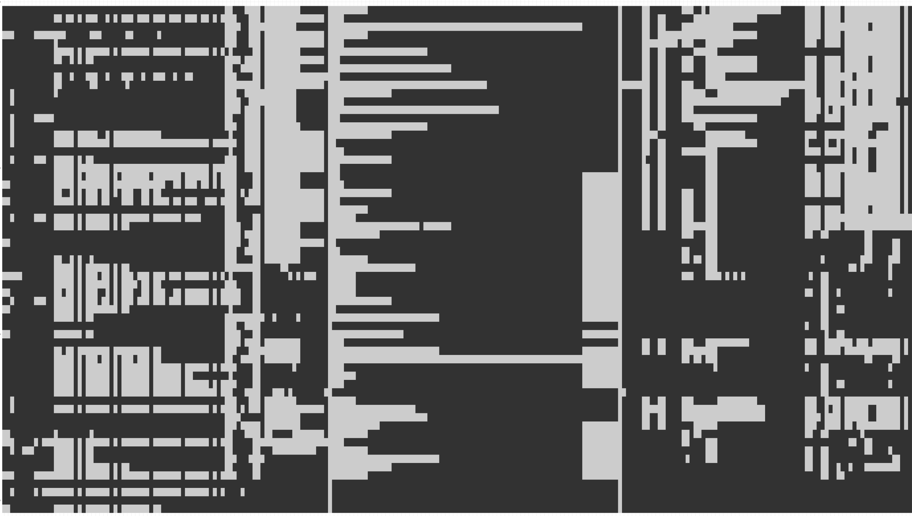

```{r setup, include=FALSE}
options(htmltools.dir.version=FALSE)
knitr::opts_chunk$set(
  fig.width=9,fig.height=3.5,fig.retina=3,
  out.width="100%",
  cache=FALSE,
  echo=FALSE,
  message=FALSE, 
  warning=FALSE,
  hiline=TRUE
)
```

```{r xaringan-themer,include=FALSE,warning=FALSE}
gc()
library(xaringanExtra)
xaringanExtra::use_xaringan_extra(c("tile_view","scribble","fit_screen","freezeframe","editable"))

library(xaringanthemer)
style_duo_accent(
  primary_color="#1381B0",
  secondary_color="#FF961C",
  inverse_header_color="#FFFFFF"
)
```

class: inverse,center,middle

background-image: url("https://external-content.duckduckgo.com/iu/?u=https%3A%2F%2Fwallpapercave.com%2Fwp%2Fwp8737359.png&f=1&nofb=1")
background-size: cover

# Learning R, From Beginner to Coding Machine

### A SIG/RIG Presentation

<br>
<br>
<br>
<br>
<br>
<br>

## Kenneth Fond

.pull-left.center.white[
#### Github: [kenf1](https://github.com/kenf1)
]

.pull-right.center.white[
#### Twitter: N/A
]

---

## Introduction

### Totally informal presentation

.pull-left[
- with a bit of humor

- and demos!
]

.pull-right[
```{r, eval=TRUE,fig.align='center',out.width='100%'}
knitr::include_graphics("https://external-content.duckduckgo.com/iu/?u=http%3A%2F%2Fwww.lovethispic.com%2Fuploaded_images%2F98303-Let-Me-Help-You-Smile.jpg&f=1&nofb=1")
```
]

---

## Learning R, Beginner to Coding Machine

--

### Disclaimer:

1. Had **some** prior coding experience (in total < 1 day)

  - 1 hour of Javascript

  - few hours of HTML/CSS

--

1. I ***still*** don't know all the inner workings of R or RStudio IDE

--

1. Did not graduate with honors from **ATE School of R Programming** 😥

.center[]

---
class: middle 

## My Journey Towards Learning R

### 3 General Stages:

.pull-left[
1. #### Beginner

1. #### Intermediate

1. #### Advanced
  
  - Cutting Edge/Experimental
]

.pull-right[

Artwork by @allison_horst
]

???
boundaries between these stages not clearly defined

---

## Beginner Stage

- Started learning R .can-edit[~ 1 year] ago

- Mostly used it for creating plots (ggplot)

.pull-right[
Example of ggplot
  
]

---

## My First Lines of R Code


---
class: middle

### More examples of my beginner code...

.pull-left[
Plots for 3 Month Timepoint

```{r, eval=TRUE,fig.align='center',out.width='100%'}

```
]

--

.pull-right[
Plots for 6 Month Timepoint

```{r, eval=TRUE,fig.align='center',out.width='100%'}

```

***Notice any similarities?***
]

*Hint: focus on the first few lines of code for each timepoint*

---

## Intermediate Stage

.pull-left[
> 1. iris

> 1. mtcars

> 1. titanic

> 1. gapminder

> 1. NHANES

]

--

### What do they have in common?

--

all 5 are publicly available, commonly used, **near clean/tidy datasets**

.pull-right[

```{r, eval=TRUE,fig.align='center',out.width='100%'}
knitr::include_graphics("https://github.com/allisonhorst/stats-illustrations/raw/master/rstats-artwork/tidydata_1.jpg")
```

Artwork by @allison_horst
]

---

## Ex: Titanic Dataset from Kaggle

```{r load-titanic,echo=TRUE,eval=FALSE}
library(tidyverse)
library(naniar)

titanic <- read_csv("./Sample Data/train.csv")

vis_miss(titanic)
```

.pull-left[
> 1. Load in libraries

> 1. Import dataset

> 1. Create shadow plot

]

.pull-right[
  
]

---

## Shadow Plot

```{r ref.label="load-titanic",echo=FALSE}

```

***Note***: Each black .can-edit[square] is an empty cell.

---

## Reality



---

## Intermediate Stage Summary

1. #### Somewhat interested in what R had to offer

  - speed run through DataCamp R courses (*Thanks Nikos!*)

1. #### Raw data starts rolling in
  
  - field day for me!

--

.center[
***Sometimes...***

  
]

---

## Tools/Skills I picked up

.pull-left[
1. R Markdown

1. Git/GitHub

1. ggplot Customization

1. other R packages within [Tidyverse](https://www.tidyverse.org/):
  - [lubridate](https://lubridate.tidyverse.org/): working with dates
  - Regular Expressions & [stringr](https://stringr.tidyverse.org/)
  - ...

1. Stats/ML
]

.pull-right[
  
]

---

## R Markdown

.left-column[
1. Organize **code** + **comments/notes** + **output** in a single report

1. Consistency + Reproducibility
]

.right-column[
  
]

???
for time being, don't worry about what happens behind the scenes
good thing is you don't have to fully understand it to use it

---

## R Markdown Demo

#### To install:

```{r echo=TRUE,eval=FALSE}
install.packages("rmarkdown")
```

"yes" to all dependencies

---

## Helpful R Markdown Resources

#### My suggested order:

1. [RStudio Introduction to R Markdown](https://rmarkdown.rstudio.com/articles_intro.html)

1. YiHui Xie's [One R Markdown Document, Fourteen Demos](https://www.rstudio.com/resources/rstudioconf-2020/one-r-markdown-document-fourteen-demos/) RSTUDIO::CONF 2020 talk

1. YiHui Xie's book: [R Markdown: The Definitive Guide](https://bookdown.org/yihui/rmarkdown/)

???
very simple -> super complex
can output other formats like pdf, can even write papers if you know enough markdown + html/css

---

## Advanced Stage

1. #### Learned + implemented more packages

  - domain-specific packages: (caret, tidymodels, mice...)
  
  - interactive plots: (plotly, trelliscopejs...)
  
  - miscellaneous: (cowplot, data.table, leaflet...)

--

1. #### Optimize for speed and efficiency

  - Build workflows

  - Reusable, dynamic code

--

1. #### Cutting Edge/Experimental
  
  - dream of code
  
  - nightmares of debugging
  
---

## My Coding Workflow

.pull-left[
1. R Project Folder

1. Set up local [Git](https://git-scm.com/) repo

1. Create R Markdown file

1. Type away!

1. .can-edit[???]

1. .can-edit[???]

1. Profit

]

.pull-right[
  
]

---

### Explained

.pull-left[
<br>
  <iframe width="600" height="338" src="https://www.youtube.com/embed/_0rHU6qAQe0" title="YouTube video player" frameborder="0" allow="accelerometer; autoplay; clipboard-write; encrypted-media; gyroscope; picture-in-picture" allowfullscreen></iframe>
]

--

.pull-right[

]

???
play intro (up until 0:26)

---

## Coding Time!

.pull-left[
  ### Remember this?
  
]

--

.pull-right[
  ### I can do this:
  
```{r eval=FALSE,echo=TRUE}
results <- trauma_mo3 %>% 
  select(-contains(c("Left","Right",
      "Original Exam"...)))
```
]

--

### Or this:
  
```{r eval=FALSE,echo=TRUE}
to_remove <- c("Left","Right","Original Exam"...)

results <- trauma_mo3[,!names(trauma_mo3) %in% to_remove]
```

---

```{r eval=FALSE,echo=TRUE}
to_remove <- c("Left","Right","Original Exam"...)

get_result <- function(dfName){
  dfName[,!names(dfName) %in% to_remove]
}

results_mo3 <- get_result(trauma_mo3)
results_mo6 <- get_result(trauma_mo6)
```

--

```{r eval=FALSE,echo=TRUE}
temp <- list.files(path="./Desktop/Raw Data",pattern=".csv")
tasked_months <- lapply(temp,read_csv)

names(tasked_months) <- make.names(tasked_months)

to_remove <- c("Left","Right","Original Exam"...)

results <- list()

for(i in 1:length(tasked_months)){
  temp_name <- names(tasked_months)[i]
  temp <- tasked_months[[i]]
  get_result <- function(dfName){
    dfName[,!names(dfName) %in% to_remove]
  }
  results[[temp_name]] <- get_result(temp)
}
```

???
top chunk uses custom function
bot chunk uses function nested within loop

---

### Add some flavor (and speed) 

.pull-left[
```{r eval=FALSE,echo=TRUE}
get_result <- function(dfName){
  dfName[,!names(dfName) %in% to_remove]
}
```
]

.pull-right[

]

--

**Alternative:**

.pull-left.w60[
```{r eval=FALSE,echo=TRUE}
library(data.table)

fastRemove <- function(dfName,varName,toDF=FALSE){
  temp <- setDT(dfName)
  temp <- temp[,!varName,with=FALSE]
  if(toDF==TRUE){
    setDF(temp)
  }else{
    setDT(temp)
  }
}
```
]

.pull-right.w35[

]

???
in theory, does same thing
in reality, performs much faster since I'm using data.table which does parallel processing (discussion for another time)

---

## Final Boss

#### for now...

```{r echo=TRUE}
library(data.table)

DTfilter <- function(dfName,purpose,varName,toDF=FALSE){
  temp <- data.table::setDT(dfName)
  if(purpose=="keep"){ #conditional for purpose
    temp <- temp[,varName,with=FALSE]
  }else if(purpose=="remove"){
    temp <- temp[,!varName,with=FALSE]
  }else if(purpose!="keep"|purpose!="remove"){
    stop("Instructions not clear, please try again")
  }
  if(toDF==TRUE){ #conditional for output format
    data.table::setDF(temp)
  }else{
    data.table::setDT(temp)
    message("Currently set to default of class `data.table`.")
  }
  return(temp)
}
```

???
why keep it to subsets when you can merge it together?
there's probably a downside for doing this

---

## Let's test it

### Before

```{r echo=FALSE}
titanic <- as.data.frame(titanic)
```

```{r echo=TRUE}
head(titanic,3)
```

--

```{r echo=TRUE}
class(titanic)
```

---

### After

```{r echo=TRUE,message=TRUE}
test_run <- DTfilter(titanic,"keep",c("Sex","Age","Fare","Embarked"),FALSE)
```

--

```{r echo=TRUE}
head(test_run,3)
```

--

```{r echo=TRUE}
class(test_run)
```

---

## Tools for Advanced R Users

### Shiny

.pull-left[
1. Create website/dashboard using R

1. Alternative to Tableau and Power BI

1. Static, interactive, or both

1. Shiny app demo
]

--

.pull-right[
  
]

???
sorry, intended for internal use atm

---

### Creating your own package

1. Used to bundle custom functions & datasets

1. Much easier to redistribute (internally or externally)

1. RR package demo

--

.pull-right[
<iframe width="690" height="388" src="https://www.youtube.com/embed/dQw4w9WgXcQ" title="YouTube video player1" frameborder="0" allow="accelerometer; autoplay; clipboard-write; encrypted-media; gyroscope; picture-in-picture" allowfullscreen></iframe>

]

.footnote[[Rick Roll Lyrics](https://www.youtube.com/watch?v=34Ig3X59_qA)]

???
[aspect scaling tool](https://www.aspectratiocalculator.com/16-9.html)
[disguised RR](https://www.youtube.com/watch?v=RvBwypGUkPo)

---

## Even more tools:

1. **rvest** - web scraping

1. **Reticulate** - run Python code alongside R code

1. **Text Mining + Natural Language Processing suite**

.center[
  ## Inspired by:
  
  
]

---

## Xaringan

1. PowerPoint presentation alternative

.center[
  .pull-left[
### Pros
- benefits of R Markdown

- integrates well with rest of workflow

- lots of customizations
  ]

  .pull-right[
### Cons
- HTML/CSS/JS heavy

- can fall into rabbit hole of customization

- has to be compiled
  ]
]

---

.center[
  ## This entire presentation was made in R with Xaringan!
  
  
]

---

```{r, eval=TRUE,fig.align='center',out.width='80%'}
knitr::include_graphics("https://github.com/allisonhorst/stats-illustrations/raw/master/rstats-artwork/rmarkdown_wizards.png")
```

Artwork by @allison_horst

---

## KF's Tips/Advice

1. Convert small simple tasks you can do in Excel to R code

--

1. Make temporary variables

--

1. Lots of ways to complete same task

--

1. Debugging

  - StackOverflow
  
  - SIG/RIG Slack

--

1. Read:

  - help pages/documentation

  - Online Resources: [Statistics Globe](https://statisticsglobe.com/), [Towards Data Science](https://towardsdatascience.com/), [StatQuest](https://statquest.org/)
  

???
no one is stopping you from coding in base R or loading 1000s of packages
  in latter case, maybe your computer does not have enough RAM to store it in memory and will tap out
just like R reserves NA, TRUE, FALSE..., have a var that is reserved for temporary stuff
other than frequently-done tasks, rare someone else will have your exact issue
  good enough for pointers in correct direction
  
---

## Final piece of advice:

1. Ultimately depends on what you want to use R for

  - not most straight-forward at times
  
  - sometimes things can get "hacky"

.center[
    
]

---


---

## Part 2, maybe?

.pull-left[
#### Didn't have time today to show:

- Semi-auto Excel entry script

- interactive dashboards
  
  - flexdashboard, shinydashboard

- in-depth workflow demo

- flowcharts

- copy + paste files

]

--

.pull-right[
#### Currently learning/working on:

- Stats/ML stuff

  - different algorithms
  
  - ensembles

- working with pdfs (CRUD)

- using a different IDE

]

---
class: center,middle

## Thanks for sticking around!

<br>


<br>
<br>

Those <u>3 full days</u> creating and customizing this presentation was **definitely** well spent.